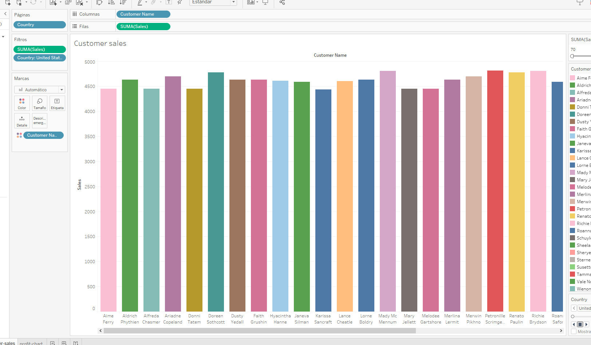

# Little Lemon Restaurant Management System

## Overview
The **Little Lemon Restaurant Management System** is designed to streamline and optimize restaurant operations. This project forms part of the **Meta Database Engineer Certificate** program offered on Coursera. It leverages **MySQL** for database handling and **Tableau** for advanced data visualization. 

The repository includes all necessary setup files, scripts, and resources required for implementation. Initial project materials are available in the `Preparation` folder.

---

## Table of Contents
- [Overview](#overview)
- [Entity-Relationship Diagram](#entity-relationship-diagram)
- [Setting Up the Database](#setting-up-the-database)
- [Stored Procedures](#stored-procedures)
  - [Retrieve Maximum Quantity](#retrieve-maximum-quantity)
  - [Validate Table Booking](#validate-table-booking)
  - [Modify Booking Details](#modify-booking-details)
  - [Insert New Booking](#insert-new-booking)
  - [Remove Booking](#remove-booking)
  - [Add Conditional Booking](#add-conditional-booking)
  - [Delete Order](#delete-order)
- [Tableau Visualizations](#tableau-visualizations)
  - [Customer Sales Analysis](#customer-sales-analysis)
  - [Profit Trends](#profit-trends)
  - [Sales Bubble Visualization](#sales-bubble-visualization)
  - [Cuisine Performance](#cuisine-performance)
  - [Interactive Dashboard](#interactive-dashboard)

---

## Entity-Relationship Diagram
An **Entity-Relationship Diagram (ERD)** was created to model the database structure. The diagram illustrates relationships among key entities, including customers, bookings, orders, and staff. View the diagram below:


---

## Setting Up the Database
Follow these steps to prepare and set up the database:

1. **Install MySQL**:
   - Download and install MySQL if it isn’t already installed.

2. **Download Database Script**:
   - Retrieve the SQL script file [LittleLemonDB.sql](./LittleLemonDB.sql) from the repository.

3. **Import the Database**:
   - Open MySQL Workbench.
   - Navigate to `Server > Data Import`.
   - Select `Import from Self-Contained File` and locate `LittleLemonDB.sql`.
   - Execute the import process by clicking `Start Import`.

---

## Stored Procedures
### 1. Retrieve Maximum Quantity
Fetches the highest quantity ordered for any item, aiding in inventory management.

```sql
CREATE PROCEDURE GetMaxQuantity()
BEGIN
  DECLARE maxQty INT;

  SELECT MAX(Quantity) INTO maxQty FROM `LittleLemonDB`.`Orders`;

  SELECT maxQty AS 'Maximum Ordered Quantity';
END;
```
```sql
CALL GetMaxQuantity();
```

### 2. Validate Table Booking
Checks if a table is available on a specific date. Returns a status message.

```sql
CREATE PROCEDURE CheckBooking(IN booking_date DATE, IN table_number INT)
BEGIN
  DECLARE table_status VARCHAR(50);

  SELECT COUNT(*) INTO @table_count
  FROM `LittleLemonDB`.`Bookings`
  WHERE `Date` = booking_date AND `TableNumber` = table_number;

  IF (@table_count > 0) THEN
    SET table_status = 'Table is already booked.';
  ELSE
    SET table_status = 'Table is available.';
  END IF;

  SELECT table_status AS 'Table Status';
END;
```
```sql
CALL CheckBooking('2022-11-12', 3);
```

### 3. Modify Booking Details
Allows updating of existing booking information.

```sql
CREATE PROCEDURE UpdateBooking(IN booking_id INT, IN new_date DATE)
BEGIN
  UPDATE `LittleLemonDB`.`Bookings`
  SET `Date` = new_date
  WHERE `BookingID` = booking_id;

  SELECT CONCAT('Booking ', booking_id, ' updated') AS 'Confirmation';
END;
```
```sql
CALL UpdateBooking(9, '2022-11-15');
```

### 4. Insert New Booking
Adds a new booking into the database with customer and table details.

```sql
CREATE PROCEDURE AddBooking(IN booking_id INT, IN customer_id INT, IN booking_date DATE, IN table_number INT, IN staff_id INT)
BEGIN
  INSERT INTO `LittleLemonDB`.`Bookings`(`BookingID`, `CustomerID`, `Date`, `TableNumber`, `StaffID`)
  VALUES(booking_id, customer_id, booking_date, table_number, staff_id);

  SELECT 'New booking added' AS 'Confirmation';
END;
```
```sql
CALL AddBooking(17, 1, '2022-10-10', 5, 2);
```

### 5. Remove Booking
Deletes a booking based on the provided ID.

```sql
CREATE PROCEDURE CancelBooking(IN booking_id INT)
BEGIN
  DELETE FROM `LittleLemonDB`.`Bookings` WHERE `BookingID` = booking_id;

  SELECT CONCAT('Booking ', booking_id, ' cancelled') AS 'Confirmation';
END;
```
```sql
CALL CancelBooking(9);
```

### 6. Add Conditional Booking
Ensures a table is not double-booked before adding a new reservation.

```sql
CREATE PROCEDURE AddValidBooking(IN booking_date DATE, IN table_number INT, IN customer_id INT, IN staff_id INT)
BEGIN
  DECLARE table_status INT;
  START TRANSACTION;

  SELECT COUNT(*) INTO table_status
  FROM `LittleLemonDB`.`Bookings`
  WHERE `Date` = booking_date AND `TableNumber` = table_number;

  IF (table_status > 0) THEN
    ROLLBACK;
    SELECT 'Booking could not be completed. Table is already booked.' AS 'Status';
  ELSE
    INSERT INTO `LittleLemonDB`.`Bookings`(`Date`, `TableNumber`, `CustomerID`, `StaffID`)
    VALUES(booking_date, table_number, customer_id, staff_id);
    COMMIT;
    SELECT 'Booking completed successfully.' AS 'Status';
  END IF;
END;
```
```sql
CALL AddValidBooking('2022-10-10', 5, 1, 1);
```

### 7. Delete Order
Removes an order and its associated delivery status from the system.

```sql
CREATE PROCEDURE CancelOrder(IN order_id INT)
BEGIN
  DECLARE order_exists INT;

  SELECT COUNT(*) INTO order_exists FROM `LittleLemonDB`.`Orders` WHERE OrderID = order_id;

  IF order_exists > 0 THEN
    DELETE FROM `LittleLemonDB`.`OrderDeliveryStatuses` WHERE OrderID = order_id;
    DELETE FROM `LittleLemonDB`.`Orders` WHERE OrderID = order_id;
    SELECT CONCAT('Order ', order_id, ' is cancelled') AS 'Confirmation';
  ELSE
    SELECT CONCAT('Order ', order_id, ' does not exist') AS 'Confirmation';
  END IF;
END;
```
```sql
CALL CancelOrder(5);
```

---

## Tableau Visualizations
### Customer Sales Analysis


### Profit Trends


### Sales Bubble Visualization


### Cuisine Performance


### Interactive Dashboard

=======
# Meta-Database-Engineer-Capstone-project
The Little Lemon Restaurant Management System optimizes operations with MySQL for database management and Tableau for data visualization. Part of the Meta Database Engineer Certificate, it streamlines bookings, orders, and inventory management. The project demonstrates integration of database modeling and analytics for efficient resource handling.
>>>>>>> e0526fc4d53036be0a1f964c40cf5bf09cca4955
